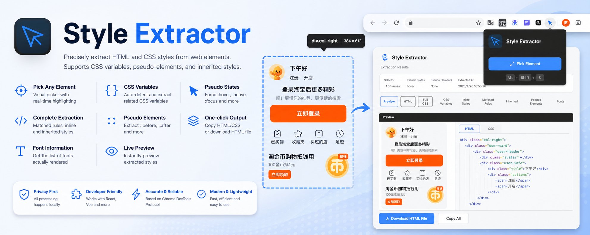

# Style Extractor

A Chrome extension for precise HTML and CSS extraction using Chrome Debugger API. Extract styles from any web element with full support for pseudo-elements, pseudo-classes, and inherited styles.



## Features

- **Precise Element Selection** - Visual element picker with real-time highlighting, navigate parent/child elements easily
- **Comprehensive Style Extraction** - Extract matched CSS rules, inline styles, and inherited styles
- **Pseudo-element Support** - Automatically extracts `::before`, `::after`, and other pseudo-element styles
- **Font Information** - Get actual rendered font information
- **Pseudo-class Activation** - Force activate `:hover`, `:active`, `:focus` states
- **One-click Copy** - Copy HTML/CSS code to clipboard
- **Export & Download** - Generate complete HTML files for download

## Installation

### From Source

```bash
# Install dependencies
npm install

# Development build (with watch mode)
npm run dev

# Production build
npm run build
```

### Load into Chrome

1. Open Chrome and navigate to `chrome://extensions/`
2. Enable "Developer mode" (toggle in top right)
3. Click "Load unpacked"
4. Select the `dist/` directory from this project
5. The extension icon will appear in your toolbar

## Usage

### Step 1: Start Selection Mode

1. Click the extension icon to open the popup
2. Click "Pick Element" button
3. The page enters selection mode with crosshair cursor
4. Hover over elements to see highlight preview

### Step 2: Select Element

1. Move mouse over the page to preview highlighted elements
2. Click on your target element
3. Use the element path selector to navigate ancestors if needed
4. Toolbar shows current selector path

### Step 3: Extract Styles

Click "Extract" button to capture:
- Complete HTML (outerHTML)
- All matched CSS rules
- Inline styles
- Inherited styles
- Pseudo-element styles (`::before`, `::after`)
- Rendered font information

### Step 4: View & Export

The Options page opens automatically showing:
- Selector path
- Pseudo-class states applied
- Extraction timestamp
- Tabbed view for different style categories
- Copy and download buttons

## Element Selection Controls

| Control | Action |
|---------|--------|
| Element Path Selector | Click to expand ancestor list, select any parent |
| ✓ Extract | Confirm and extract styles |
| ✕ Cancel | Return to selection mode (ESC) |
| ↑ Parent | Navigate to parent element |

## Keyboard Shortcuts

- `ESC` - Cancel selection mode

## Technical Stack

- React 18 + TypeScript
- Chrome Extension Manifest V3
- Chrome DevTools Protocol (CDP)
- esbuild for bundling

## Project Structure

```
style-extractor/
├── extension/
│   ├── manifest.json           # Extension manifest
│   ├── background/             # Service Worker
│   │   └── service-worker.ts
│   ├── content/                # Content scripts
│   │   └── content-script.ts
│   ├── popup/                  # Popup UI (React)
│   │   ├── popup.tsx
│   │   ├── options.tsx
│   │   └── components/
│   ├── ui/                     # UI components
│   │   ├── selector-ui.ts
│   │   ├── highlight.ts
│   │   ├── toolbar.ts
│   │   └── breadcrumb.ts
│   └── utils/                  # Utility functions
│       ├── cdp-client.ts
│       └── style-assembler.ts
├── build.mjs                   # Build script
└── dist/                       # Build output
```

## Core CDP Commands

```typescript
// Enable domains
DOM.enable()
CSS.enable()
Runtime.enable()

// Get document root
DOM.getDocument()

// Query element node
DOM.querySelector({ nodeId, selector })

// Force pseudo-class state
CSS.forcePseudoState({ nodeId, forcedPseudoClasses: ['hover'] })

// Get matched styles
CSS.getMatchedStylesForNode({ nodeId })

// Get font information
CSS.getPlatformFontsForNode({ nodeId })

// Get outer HTML
DOM.getOuterHTML({ nodeId })
```

## Limitations

- **Permissions** - Requires `debugger` permission; you'll see a permission prompt on first use
- **Restricted Pages** - Cannot work on `chrome://` or `chrome-extension://` pages
- **Debugger Connection** - Only one debugger can be attached at a time
- **Dynamic Content** - If DOM changes during selection, re-select the element

## Troubleshooting

| Issue | Solution |
|-------|----------|
| Cannot locate element | Page DOM may have changed; re-select the element |
| Incomplete styles | Some styles require specific states; the tool auto-activates common pseudo-classes |
| Debugger connection failed | Refresh the page or restart Chrome |

## License

MIT
